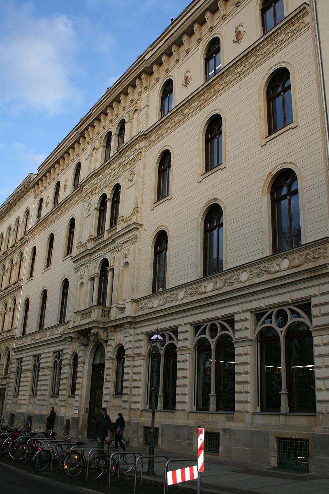

#**Linz**

[Linz] (https://de.wikipedia.org/wiki/Linz) ist die Hauptstadt von Oberösterreich und mit ca. 200.000 Einwohnern die drittgrößte Stadt Österreichs.

##Wappen
![] (https://de.wikipedia.org/wiki/Linz#/media/File:Wappen_Linz.svg)
Auf dem Wappen der Stadt Linz sieht man symbolisiert das Schloss Linz und die Donau darunter.

## Geografie
Linz liegt 266 Meter über dem Meeresspiegel und besitzt eine Fläche von rund 96 Quadratkilometer.

##Bezirke der Stadt Linz
Innere Stadt
Urfahr
Pöstlingberg
St.Magdalena
Dornach
Kaplanhof
Franckviertel
Bulgariplatz
Froschberg
Bindermichl
Spallerhof
Neue Heimat
Kleinmünchen
Hafen
Ebelsberg
Pichling

##Bild
